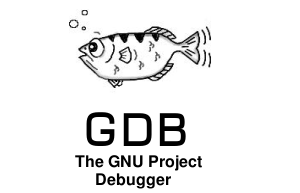

# Les bases du debug
gdb, valgrind & cie


---
<!-- _class: slide -->
Sommaire

0. Objectifs de cet atelier
1. Valgrind:
    a. Compiler pour le debug (-g3 et ses amis)
    b. Command-line flags
    c. Lecture de l'output (backtrace, types de leaks et erreurs diverses)
    d. Intégrer Valgrind à son workflow
    e. De l'importance des erreurs Valgrind
2. Debugger
    a. Quand utiliser un Debugger?
    b. OK mais c'est quoi?
	c. GDB: GNU Debugger
	d. Démonstration & visualisation du workflow
3. Conclusion

---
<!-- _class: slide -->
0) Objectifs de cet atelier

- Mieux comprendre Valgrind et ses applications
- Découvrir GDB et son workflow
- Avoir des outils pour diagnostiquer les problèmes de conception logique

---
<!-- _class: slide -->
<!--- Valgrind c'est plus que seulement Memcheck -->

1) Valgrind
- Multitude d'outils: Memcheck, Helgrind, CacheGrind...
- Exécute le programme sur un CPU virtuel
- Désassemble le code, ajoute ses tests et recompile le tout
- Affiche les erreurs rencontrées en se basant sur les informations de debug générées par le flag -g[1, 2, 3]
- ⚠️ Ralentit les programmes (jusqu'à 50x plus lents)

```
# le même programme avec et sans Valgrind:
-----------------------------------------
./btc inputs/input.txt          | 0.00s |
valgrind ./btc inputs/input.txt | 0.47s |
```
---
<!-- _class: slide -->
1) Valgrind / a. Compiler pour le debug

- Les flags de debug sont relatifs au compilateur :

```
gcc -Werror -Wextra -Wall -g3 | <= coucou !
```

- Permettent d'ajouter ou de retirer des informations au binaire.
- ⚠️ Ils alourdissent les programmes.

```
| FLAG                 | POIDS  | BINAIRE |
-------------------------------------------
| -g3 [maximum d'info] | 175664 |  btc    |
| -g0 [pas d'info]     | 80248  |  btc    |
| -0fast [optimisé]    | 47496  |  btc    |
```

---
<!-- _class: slide -->
1) Valgrind / b. Command-line flags

```
# El famoso:
 --leak-check=full              | active la backtrace
 --show-leaks-kind=all          | active le suivi de tous les types de leak
 --trace-children=yes           | monitore les produits des forks
 --track-fds=yes                | monitore les fds utilisés par le programme

# Utiles:
 --q & --v                      | quiet et verbose, pour avoir plus ou moins d'informations
 --log-file="filename"          | redirige l'output de Valgrind dans un fichier
 --suppressions=<filename>      | permet d'ignorer les leaks provenant de certains appels de fonction
 --vgdb=yes                     | après chaque message d'erreur, prompt à ouvrir GDB au point où l'erreur est intervenue. 
                                | Reprend l'exec où elle s'était arrêtée après la sortie de GDB
```

- Tous disponibles sur le man de Valgrind.

---
<!-- _class: slide -->
1) Valgrind / c.0. Lecture de l'output
a. La backtrace
- Permet de suivre le cycle de vie de votre pointeur,
- Voir où il récupère un retour de fonction ou est réalloué,
- Se lit de bas en haut

```
|-----------------------------------------------------------------------------------------------------|
| PROCESS ID | STACK ADDRESS  | FUNCTION CALL                 | EXPLICATION                           |
|------------|----------------|-------------------------------|---------------------------------------|  ^
| ==43274==  | at 0x4848899:  | malloc (in /path/to/malloc)   | la mémoire perdue a été allouée ici...|  | 6
| ==43274==  |   by 0x10A387: | ft_calloc (in /path/to/this)  | par cet appel de fonction             |  | 5
| ==43274==  |   by 0x109D6B: | append_cmd (utils.c:87)       | qui a été fait ici...                 |  | 4
| ==43274==  |   by 0x109525: | fetch_a_path (init_args.c:56) | qui a été fait ici...                 |  | 3
| ==43274==  |   by 0x10981B: | main (main.c:27)              | qui a été fait ici!                   |  | 2
|-----------------------------------------------------------------------------------------------------|  | 1

```

---
<!-- _class: slide -->
1) Valgrind / c.1. Lecture de l'output
b. Les types de leak
```
==43274== LEAK SUMMARY:
==43274== definitely lost: 12 bytes in 1 blocks	| il n'y a pas de pointeur vers ce bloc de mémoire
                                                | il ne peut donc pas être free

==43274== indirectly lost: 0 bytes in 0 blocks 	| un pointeur existe, mais il n'est accessible que par un
                                                | bloc mémoire definitely lost

==43274== possibly lost: 0 bytes in 0 blocks	| un pointeur en direction du bloc existe, 
                                                | mais il ne pointe pas vers le début.

==43274== still reachable: 0 bytes in 0 blocks	| un pointeur vers le bloc existe mais il n'a pas été free

==43274== suppressed: 0 bytes in 0 blocks	| leaks cachées par le fichier de suppression
```
⚠️ Un leak est un leak, même s'il est still reachable ⚠️ 

---
<!-- _class: slide -->
1) Valgrind / c.2. Lecture de l'output
c. Les autres erreurs de Valgrind

- `Invalid read of size n`: peut causer un segfault
- `Conditional jump or move depends on uninitialised value(s)`: le programme essaye d'évaluer une variable non-initialisée
- `Invalid free()`: le pointeur ne peut pas être free (soit il l'a déjà été, soit il n'a pas été alloué sur la heap)

---
<!-- _class: slide -->
1) Valgrind / d. Integrer Valgrind a son workflow

- Marre de devoir se souvenir de tous les flags dont vous avez besoin pour Valgrind ? 
- **Solution**: utiliser les outils a votre disposition !
- Possible de creer une regle `make` pour vous faciliter la vie. 
```make
V_PARAMS:= valgrind --trace-children=yes --track-fds=yes --leak-check=full --suppressions=$(M_SUP) --show-leak-kinds=all -s
run: all
	$(V_PARAMS) ./$(NAME)
``` 
---
<!-- _class: slide -->
1) Valgrind / e. De l'importance des erreurs Valgrind

- Si Valgrind remonte une erreur, c'est qu'elle peut causer un problème.
- Un invalid read est un segfault qui a eu de la chance.
- L'IT, c'est une histoire de scale: ce qui ne pose pas problème sur GNL sera sûrement un souci sur un Kernel ou une application Cloud utilisée par des milliers de personnes.

---
<!-- _class: slide -->
2) Debugger
a. Quand utiliser un debugger?

- Quand on ne comprend pas
- Diagnostiquer des crash
- Diagnostiquer des leaks
- ...

---
<!-- _class: slide -->
2) Debugger
b. OK mais c'est quoi?

Fini les printf dans tous les sens!
- Analyse de l'execution de son code

Acces a la memoire d'un programme lors de son execution
Controle sur l'execution de son programme

---
<!-- _class: slide -->
2) Debugger
c. GDB

- Un debugger basique pour le C/C++
- Utilisable dans le terminal
- Intégration avec vos IDE favoris (VS Code, CLion...)
- Pas mal de customisation (débrouillez-vous)
- Fonctionne très bien!

---
<!-- _class: slide -->
2) Debugger
d. Les bases (DEMO avec GDB)

- Breakpoints
- Contrôle de l'exécution
- Inspection d'une frame
- Backtrace
---
# Any Questions ? 
 + 

==

<3